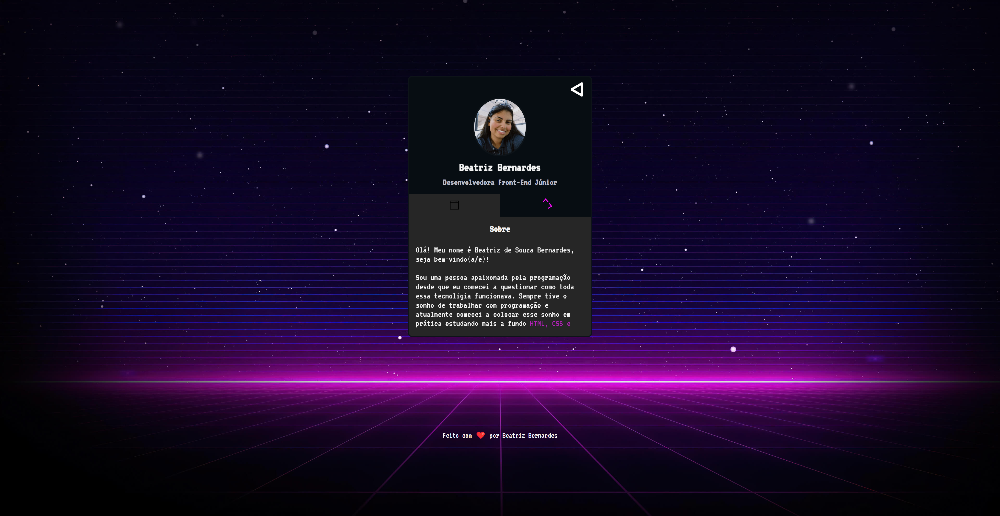

# Mini Portfólio

Este projeto foi realizado durante a Semana MapaDev, da equipe [Dev em Dobro](https://github.com/devemdobro), em que construímos um mini portiflio expondo um pouco mais sobre cada um e informando nossas redes. Em breve farei mais atualizações.

_**Veja o resultado [clicando aqui](https://beaasb.github.io/NLW-Desafio/)**_

## 🛠️Tecnologias 
    - HTML
    - CSS
    - Git e GitHub
    - JavaScript

## ✉️ Contato
    biiahh.bb@gmail.com